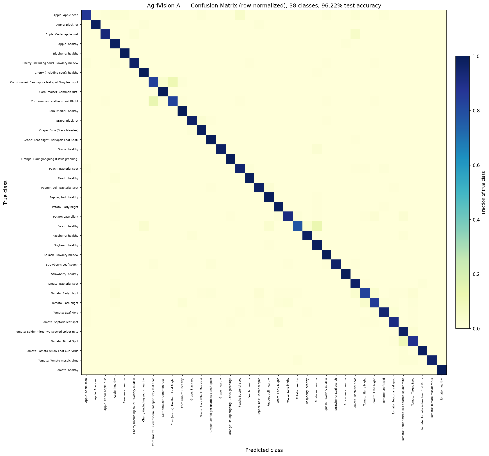

# 🌿 AgriVision-AI

**An end-to-end plant disease diagnosis system** — from a single leaf photo to a farmer-ready treatment report, powered by deep learning and explainable AI.


---

## 🔍 What it does

Upload a photo of a crop leaf. AgriVision-AI:

1. **Classifies the disease** using a CNN trained on leaf imagery (38 classes across 14+ crop species)
2. **Shows *why*** — a Grad-CAM heatmap overlay highlighting exactly which region of the leaf drove the prediction
3. **Estimates severity** — quantifies how much of the leaf is affected, not just a binary healthy/diseased label
4. **Cross-checks live weather** against the disease's known risk conditions, to flag whether current conditions favor its spread
5. **Looks up treatment guidance** — symptoms, cause, chemical + organic treatment, prevention, and fertilizer advice from a built-in knowledge base
6. **Generates a downloadable PDF report** the farmer can keep or share

All of this is wrapped in a simple Flask web interface — upload a photo, get a full diagnostic report back.

---

## 🧠 Why this is different from a typical "CNN plant disease classifier"

Most plant-disease projects stop at classification accuracy. AgriVision-AI treats classification as step one of a decision-support pipeline:

| Feature | What it adds |
|---|---|
| **Grad-CAM explainability** | Builds trust — shows the model isn't guessing from background artifacts |
| **Severity estimation** | Distinguishes "just started" from "advanced infection," which changes the recommended action |
| **Weather-risk correlation** | Ties prediction to agronomy — tells the user if conditions favor disease spread *right now* |
| **Structured knowledge base** | Turns a label into actionable treatment/prevention guidance, not just a name |
| **PDF report generation** | Produces something a farmer can actually act on or share offline |

---

## 🏗️ Architecture

```
                    ┌─────────────────┐
   Leaf Photo  ───▶ │   CNN Classifier │ ───▶ Predicted Disease + Confidence
                    └────────┬─────────┘
                             │
              ┌──────────────┼──────────────┬───────────────┐
              ▼              ▼              ▼               ▼
        ┌──────────┐  ┌────────────┐  ┌───────────┐  ┌──────────────┐
        │ Grad-CAM │  │  Severity  │  │  Weather   │  │ Knowledge    │
        │ Heatmap  │  │ Estimation │  │  Risk API  │  │ Base Lookup  │
        └──────────┘  └────────────┘  └───────────┘  └──────────────┘
              │              │              │               │
              └──────────────┴──────────────┴───────────────┘
                             ▼
                   ┌───────────────────┐
                   │  Flask Web App +   │
                   │  PDF Report Output │
                   └───────────────────┘
```

---

## 📊 Results

Evaluated on a held-out test set of **10,861 images** across all 38 classes.

| Metric | Value |
|---|---|
| **Overall test accuracy** | **96.22%** |
| Weighted precision | 96.28% |
| Weighted recall | 96.22% |
| Weighted F1-score | 96.20% |
| Macro F1-score | 95% |
| Number of classes | 38 |
| Dataset | PlantVillage |

**33 of 38 classes score above 0.90 F1.** The model performs best on visually distinct diseases (Tomato Yellow Leaf Curl Virus, Citrus Greening, Tomato healthy — all ≥0.99 F1) and is weakest on classes that are visually similar to one another or have limited support, e.g. **Corn Cercospora leaf spot** (0.79 F1 — confusable with Northern Leaf Blight) and **Potato healthy** (0.80 F1, only 31 test samples).



*Row-normalized confusion matrix — the near-perfect diagonal shows the model rarely confuses unrelated disease classes; the few visible off-diagonal cells are between diseases that are genuinely difficult to distinguish visually, even for humans.*

Full per-class precision/recall/F1 breakdown: [`evaluation/classification_report.txt`](evaluation/classification_report.txt)

---

## 🚀 Getting Started

### Prerequisites
```bash
git clone https://github.com/subhashree-2005/AgriVision-AI.git
cd AgriVision-AI
pip install -r requirements.txt
```

### Run inference on a single image
```bash
python full_pipeline.py path/to/leaf_photo.jpg
```

### Run the web app
```bash
cd website
python app.py
```
Then open `http://127.0.0.1:5000` in your browser.

> **Note:** Trained model weights (`saved_models/cnn.keras`) and the training dataset are not included in this repo (too large for git). See [Model & Dataset](#-model--dataset) below.

---

## 📁 Project Structure

```
AgriVision-AI/
├── inference/            # Preprocessing + prediction
├── gradcam/              # Grad-CAM explainability
├── severity/             # Lesion severity estimation
├── weather/               # Weather-based risk assessment
├── knowledge_base/       # Disease info: symptoms, treatment, prevention
├── evaluation/            # Accuracy/metrics scripts & results
├── notebooks/             # Training / experimentation notebooks
├── reports/               # PDF report generator
├── website/                # Flask web app (upload → diagnosis)
├── full_pipeline.py        # Single entry point tying it all together
└── requirements.txt
```

---

## 🧰 Tech Stack
- **Deep Learning:** TensorFlow / Keras (CNN)
- **Explainability:** Grad-CAM
- **Computer Vision:** OpenCV
- **Backend:** Flask
- **Reporting:** ReportLab (PDF generation)
- **External Data:** OpenWeatherMap API

---

## 📦 Model & Dataset

This repo ships the pipeline code, not the trained weights or dataset (kept out of git via `.gitignore` due to size). To reproduce:
1. Train on the [PlantVillage dataset](https://www.kaggle.com/datasets/emmarex/plantdisease) (or your dataset of choice) using `notebooks/`
2. Place the resulting model at `saved_models/cnn.keras`
3. Confirm `class_indices.json` matches your training run

---

## 🗺️ Roadmap
- [ ] Mobile app / camera capture support
- [ ] Multi-leaf batch diagnosis
- [ ] Regional disease-outbreak dashboard using aggregated weather-risk data
- [ ] Model quantization for on-device inference

---

## 📄 License
MIT — see [LICENSE](LICENSE)

## 🙋 Author
**Subhashree** — [GitHub](https://github.com/subhashree-2005)